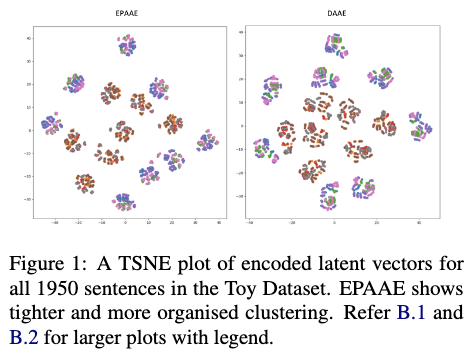
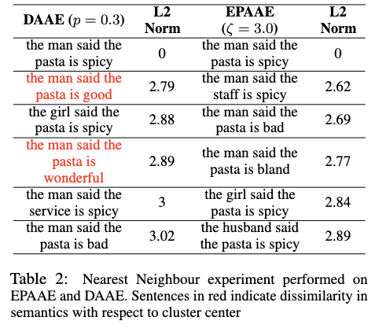
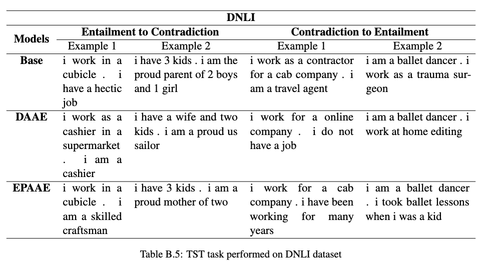

# Embedding Perturbed Adversarial AutoEncoders (EPAAE)
This repo contains the code and data of the following paper:  
"Towards Robust and Semantically Organised Latent Representations for
Unsupervised Text Style Transfer" 
*Sharan Narasimhan, Suvodip Dey, Maunendra Sankar Desarkar*
(to be published in the Proceedings of NAACL 2022).
For now, the arxiv version is available at: https://arxiv.org/abs/2205.02309


<p align="center"></p>
<!-- <p align="center"></p> -->
<p align="center"></p>
<p align="center"></p>

For more samples from qualitative experiments using EPAAE, please refer to the Appendix of the paper.

<!-- ## Video
[](https://www.youtube.com/watch?v=ioFQ8l-Fl7c) -->

## Dependencies
Python 3.8.5+, PyTorch 1.11+

## Download data and outputs
Download the 'data' and 'outputs' folders from: https://drive.google.com/drive/folders/1ZvAPAfd_pGFb37vA9gOyTBUiEOgPmHBJ?usp=sharing
Place the 'data' folder in the project directory.

## Training
.
A sample command to train a simple AAE is:
```
python3 train.py --train data/yelp-shen/train.txt --valid data/yelp-shen/valid.txt --model_type aae --lambda_adv 10 --save-dir checkpoints/yelp-shen/aae-adv10
```
To train various models, use the following options:
- VAE: `--model_type vae --lambda_kl 0.1 --save-dir checkpoints/snli/vae_kl0.1`
- AAE: `p3 train.py --train ./data/yelp-shen/train.txt --valid data/yelp-shen/valid.txt  --model_type aae --lambda_adv 10 --save-dir ./checkpoints/yelp-shen/test --gpu 0
- LAAE: `--model_type aae --lambda_adv 10 --lambda_p 0.01 --save-dir checkpoints/snli/aae_p0.01`
- DAAE(p=0.3): `--model_type aae --lambda_adv 10 --noise 0.3,0,0,0 --save-dir checkpoints/snli/daae`, where `--noise P,P,P,K` specifies word drop probability, word blank probability, word substitute probability, max word shuffle distance, respectively
- EPAAE(zeta=3.0) : `--model_type aae --lambda_adv 10 --save-dir checkpoints/scitail/aae-z3.0 --embd-noise --zeta 3.0 --noise-type centered-gau --gpu 5 --batch-size 32`
- EPAAE(p=0.1, zeta=3.0) : `--model_type aae --lambda_adv 10 --save-dir checkpoints/snli/aae-z3.0 --embd-noise --zeta 3.0 --noise-type centered-gau --noise 0.1,0,0,0 --gpu 0`

Run `python3 train.py -h` to see all training options.

## Testing
- To generate sentences from the model, an example command is:
`
python test.py --sample --n 10000 --output sample --checkpoint checkpoints/snli/epaae-z2.0/
`
- To perform Text Style Transfer via vector arithmetic, an example command is:
`python3 test.py --tst-on-test --dataset snli --checkpoint checkpoints/supervised/snli/dir_of_pretrained_model --gpu 7 --model-name model_best.pt
`
Please check test.py for more experiment scripts such as TSNE, interpolation, reconstruction. For any questions or reports of bugs, please add an issue and we will resolve it.

## Pretrained models and outputs
Please download and use the models we trained as part of this paper:
https://drive.google.com/drive/folders/1fWXr8trmpqzaRCYzgnYzurdm3zwJpedN?usp=sharing
Use --checkpoint to specify the path of the model. Please feel free to create an issue or email me regarding doubts or issues.

## Citation
@article{Narasimhan2022TowardsRA,
  title={Towards Robust and Semantically Organised Latent Representations for Unsupervised Text Style Transfer},
  author={Sharan Narasimhan and Suvodip Dey and Maunendra Sankar Desarkar},
  journal={ArXiv},
  year={2022},
  volume={abs/2205.02309}
}

## Other considerations
This repo has been built over elements from the clean and high-quality code present in https://github.com/shentianxiao/text-autoencoders, so we encourage you to also check out their work on Text Style Transfer.

Please refer to `tips.txt` for more details.

