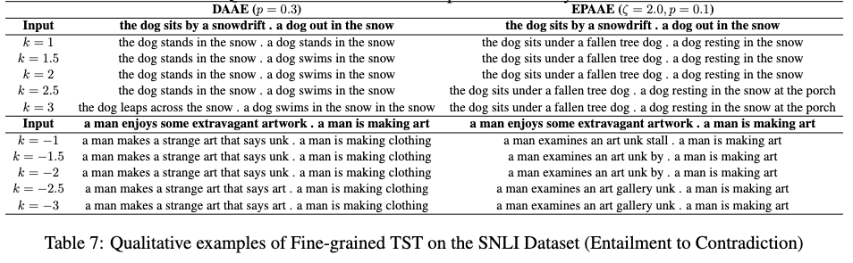

# Embedding Perturbed Adversarial AutoEncoders (EPAAE)
This repo contains the code and data of the following paper:  
"Towards Robust and Semantically Organised Latent Representations for
Unsupervised Text Style Transfer" 
*Sharan Narasimhan, Suvodip Dey, Maunendra Sankar Desarkar*
(to be published in the Proceedings of NAACL 2022)


<p align="center"></p>
<!-- <p align="center"></p> -->
<p align="center"></p>
<p align="center"></p>

For more samples from qualitative experiments using EPAAE, please refer to the Appendix of the paper.

<!-- ## Video
[](https://www.youtube.com/watch?v=ioFQ8l-Fl7c) -->

## Dependencies
Python 3.8.5+, PyTorch 1.11+

## Download data and outputs
Download the 'data' and 'outputs' folders from: https://drive.google.com/drive/folders/1ZvAPAfd_pGFb37vA9gOyTBUiEOgPmHBJ?usp=sharing
Place the 'data' folder in the project directory.

## Training
Coming soon.
<!-- The basic training command is:
```
python train.py --train data/yelp/train.txt --valid data/yelp/valid.txt --model_type aae --lambda_adv 10 --noise 0.3,0,0,0 --save-dir checkpoints/yelp/daae
```
To train various models, use the following options:
- AE: `--model_type dae --save-dir checkpoints/yelp/ae`
- VAE: `--model_type vae --lambda_kl 0.1 --save-dir checkpoints/yelp/vae_kl0.1`
- AAE: `--model_type aae --lambda_adv 10 --save-dir checkpoints/yelp/aae`
- LAAE: `--model_type aae --lambda_adv 10 --lambda_p 0.01 --save-dir checkpoints/yelp/aae_p0.01`
- DAAE: `--model_type aae --lambda_adv 10 --noise 0.3,0,0,0 --save-dir checkpoints/yelp/daae`, where `--noise P,P,P,K` specifies word drop probability, word blank probability, word substitute probability, max word shuffle distance, respectively

Run `python train.py -h` to see all training options. -->

## Testing
Coming soon.
<!-- After training, the model can be used for different tasks.

To reconstruct input data, run:
```
python test.py --reconstruct --data data/yelp/test.txt --output test --checkpoint checkpoints/yelp/daae/
```

To generate sentences from the model, run:
```
python test.py --sample --n 10000 --output sample --checkpoint checkpoints/yelp/daae/
```

To perform sentence manipulation via vector arithmetic, run:
```
python test.py --arithmetic --data data/yelp/tense/valid.past,data/yelp/tense/valid.present,data/yelp/tense/test.past --output test.past2present --checkpoint checkpoints/yelp/daae/
python test.py --arithmetic --k 2 --data data/yelp/sentiment/100.neg,data/yelp/sentiment/100.pos,data/yelp/sentiment/1000.neg --output 1000.neg2pos --checkpoint checkpoints/yelp/daae/
```
where the difference between the average latent representation of the first two data files will be applied to the third file (separated by commas), and `k` denotes the scaling factor.

To perform sentence interpolation between two data files (separated by a comma), run:
```
python test.py --interpolate --data data/yelp/interpolate/example.long,data/yelp/interpolate/example.short --output example.int --checkpoint checkpoints/yelp/daae/
```

The output file will be stored in the checkpoint directory. -->

## Citation
Coming soon.

## Other considerations
This repo has been built over elements from the clean and high-quality code present in https://github.com/shentianxiao/text-autoencoders, so we encourage you to also check out their work on Text Style Transfer.

Please refer to `tips.txt` for more details.

